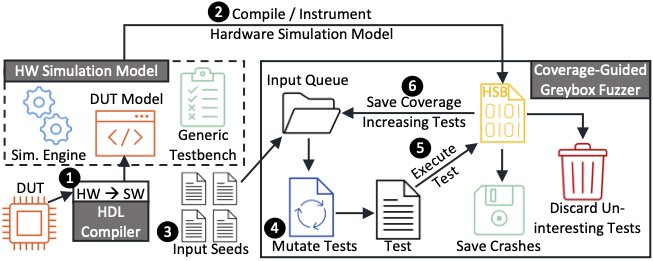

# Fuzzing Hardware Like Software

**Maintainer**: Timothy Trippel
<br>
**Personal Website**: https://timothytrippel.com
<br>

<figure>
  <p align="center">
    
    <br>
    <b>Figure 1: Fuzzing Hardware Like Software.</b>
  </p>
</figure>

Due to the economic and reputational incentives to design and fabricate flawless
hardware, design verification research has been an active arena. Unfortunately
the fruits of this labor mainly consist of strategies concentrated at two
extremes: 1) broad coverage through constrained random verification, or 2)
(bounded) formal verification. Moreover, both of these techniques require
extensive implementation knowledge of the Design Under Test (DUT) to be
effective.

To close this gap, we propose _fuzzing hardware like software_ to automate test
vector generation in an intelligent manner---that boosts coverage---_without_
requiring expensive Design Verification (DV) engineers and tools. A technical
paper describing this project can be found
[here](https://arxiv.org/pdf/2102.02308.pdf).

In this project, we demonstrate how to translate RTL hardware to a software
model, and leverage coverage-guided software fuzzers---like
[AFL](https://github.com/google/AFL)---to automate test vector generation for
hardware verification (Figure 1). Specifically we demonstrate this technique on
hardware from the [OpenTitan](https://opentitan.org/) IP ecosystem. While we do
not suggest this as a replacement to traditional DV methods for sign-off, we
argue this technique serves a low-cost preventative mechanism to identify
complex hardware vulnerabilities _before_ they are exploited for malice.

To understand the layout of this project and how to get started, read below.

## Directory Structure

### docs

This directory currently only contains a document that describes how to
contribute to this project and some figures that are displayed in this README.
However, it will be the location of any future documentation that is added.

### experiment_scripts

This directory contains some python scripts to automate launching large batches
of fuzzing experiments on GCP VMs. Additionally there are some scripts that can
be used to plot fuzzing data using Seaborn/Matplotlib.

### hw

This directory contains several supporting files to fuzz various various
OpenTitan hardware IP blocks. Currently, the following OpenTitan IP blocks are
supported: AES, HMAC, KMAC, and the RV Timer. Additionally, a subdirectory
called _ot_template_ can be copied, and the files within edited, to bring-up 
another OpenTitan IP block for fuzzing. Lastly, a custom digital _lock_ hardware
block is included to stress test our fuzzing infrastructure. This block is
actually autogenerated by a tool written in Rust (using the
[kaze](https://docs.rs/kaze/0.1.18/kaze/) crate). For more details checkout the
technical paper linked above.

### infra

This directory contains several subdirectories that contain Dockerfiles and
Shell/Python scripts that makeup a containerized infrastructure for fuzzing
hardware designs at scale. This infrastructure is modeled after Google's
[OSS-Fuzz](https://github.com/google/oss-fuzz) project. This infrastructure can
be used to jumpstart fuzzing hardware locally or on GCP (provided you have an
active account). See _Getting Started_ below for how to build this
infrastructure. Read the technical paper above for exactly what is included in
the fuzzing infrastructure.

### tests

This directory contains some HJSON fuzzing configuration files along with a
Python script to test the overall fuzzing infrastructure is successfully
simulating OpenTitan hardware.

## Getting Started

### I. Clone/Fork Repository

1. `git clone https://github.com/googleinterns/hw-fuzzing.git`
2. `cd hw-fuzzing`

### II. Set Environment Variables

To use any of the fuzzing infrastructure, which consists of: 1) building several
Docker images to isolate fuzzing each target hardware IP block, and 2) using two
(included) Python packages, some environment variables must be set. You can set
them system wide, however, I recommend using the
[direnv](https://github.com/direnv/direnv) tool to set/unset them when you
enter/leave your _hw-fuzzing_ project directory.

##### Using direnv (assuming it is installed):

1. Create a `.envrc` file in the hw-fuzzing root directory with the following:

```
export HW_FUZZING=$(pwd)
export PYTHONPATH="./:../:$(pwd)/infra/hwfp:$(pwd)/infra/base-sim/hwfutils"
```

2. `direnv allow`

##### Setting system-wide:

Add the above two lines to your _.bashrc_ or _.zshrc_ (depending on the shell
you use), except replace the _\$(pwd)_ within each statement with the global
path to your _hw-fuzzing_ directory.

### III. Install Python Dependencies

The automated Hardware Fuzzing Pipeline (HWFP) Python tooling is tested using
Python 3.8, and requires the following dependencies.

1. Create Python virtual environment (not required, but recommended).
2. Activate virtual environment (if you made one).
3. `pip install -r infra/hwfp/requirements.txt`
4. `pip install -r infra/base-sim/hwfutils/requirements.txt`

### IV. [Install Docker](https://docs.docker.com/get-docker/)

### V. Build Docker Infrastructure

1. `make build-infra`
2. Grab a cup of coffee ☕... this will take a while since we are building LLVM
   here.

### VI. Fuzz a Design

##### a. Fuzzing Locally

1. `make fuzz-<core>` where `<core>` is [aes, hmac, kmac, rv_timer] to launch
   interactive container.
2. `run` to begin RTL translation, intrustmentation, and fuzzing (if in manual
    mode, which is default, otherwise this step can be skipped).
2. Press `Ctrl+c` to terminate fuzzing and begin final coverage tracing.

##### b. Fuzzing on GCP

1. Create GCP account.
2. Create a GCS bucket to store all fuzzing data.
3. Edit the _gcp_config.hjson_ file with your GCP project details.
4. Edit the value for the _run_on_gcp_ key in the _cpp_afl.hjson_
   configuration file for the core you want to fuzz in _hw/`<core>`/_.
5. Run `make fuzz-<core>`
